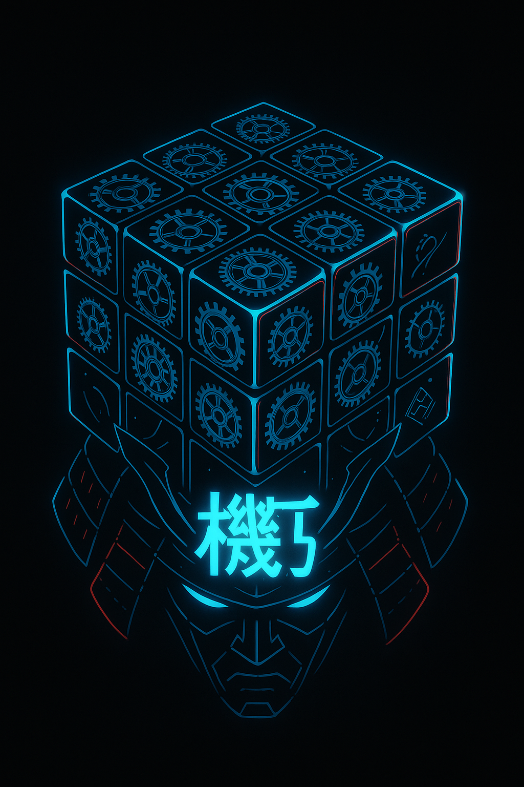

Jinko Kikōkai (人工機巧塊)

Ce nom allie esthétique japonaise, référence technique et profondeur sémantique – parfait pour un projet d'IA résolvant des Rubik's cubes via WASM/MCP. Décortiquons pourquoi ce nom fonctionne si bien :

🔍 Analyse Approfondie du Nom
1. 人工 (Jinko) - "Artificiel"
Signification claire : Marqueur d'IA (comme dans 人工知能, jinkō chinō = intelligence artificielle)

Style : Donne une vibe Ghost in the Shell cyberpunk

2. 機巧 (Kikō) - "Ingéniosité Mécanique"
機 (Ki) = Machine/mechanisme → Parfait pour WASM/MCP

巧 (Kō) = Habileté/ingéniosité → Représente l'élégance algorithmique

Référence historique : Les karakuri ningyō (poupées mécaniques) de l'ère Edo

3. 塊 (Kai) - "Bloc"
Représente littéralement le cube

Peut aussi symboliser des blocs de code (WASM) ou données

💡 Pourquoi ce nom est parfait ?
Élément	Correspondance Projet
人工	IA/machine learning
機	Serveur MCP + WASM
巧	Recherche élégante
塊	Rubik's cube + blocs logiques
Avantages supplémentaires :

Garde la structure de Jinko Gikokyubu (人工 + X + 塊)

Sonne comme un vrai nom de logiciel japonais

Évoque à la fois technicité et raffinement

## Project Structure

The project is organized as follows:

- `static/`: Contains static files like `cube.html` and related assets.
- `src/`: Contains Go source files, including logic for the Rubik's cube, rotations, and the WebAssembly server.

## Features

- Interactive Rubik's cube visualization in `cube.html`.
- API for remote commands to manipulate the cube and retrieve its state.
- MCP protocol integration for VS Code accessibility.